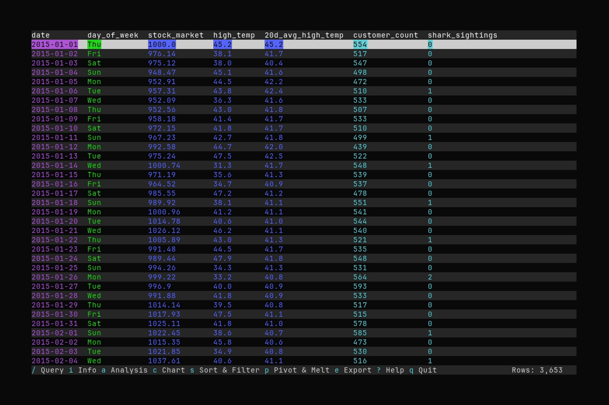
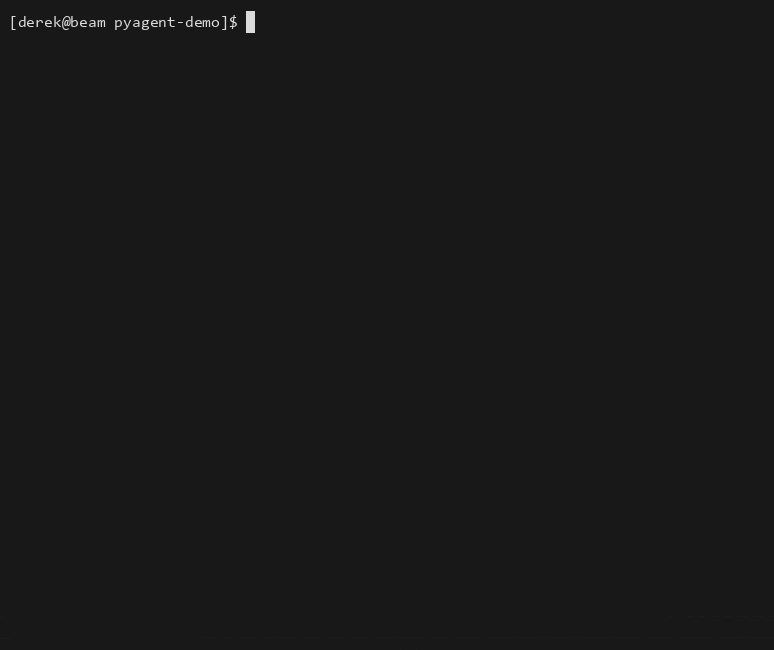
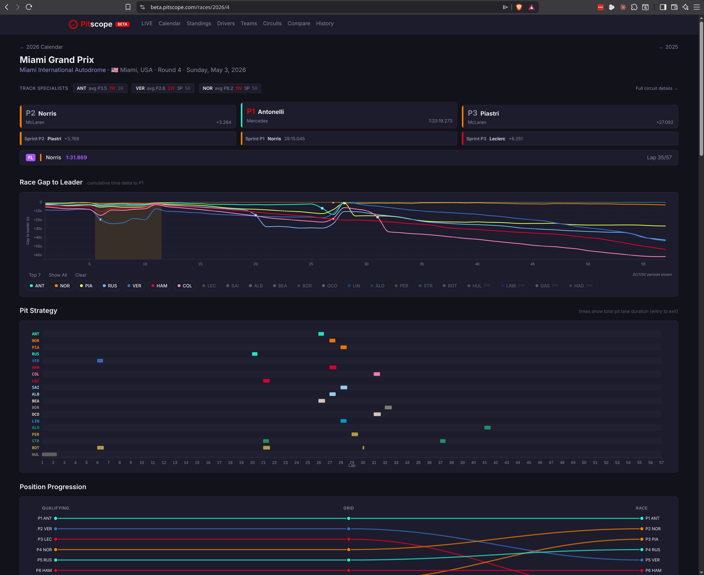
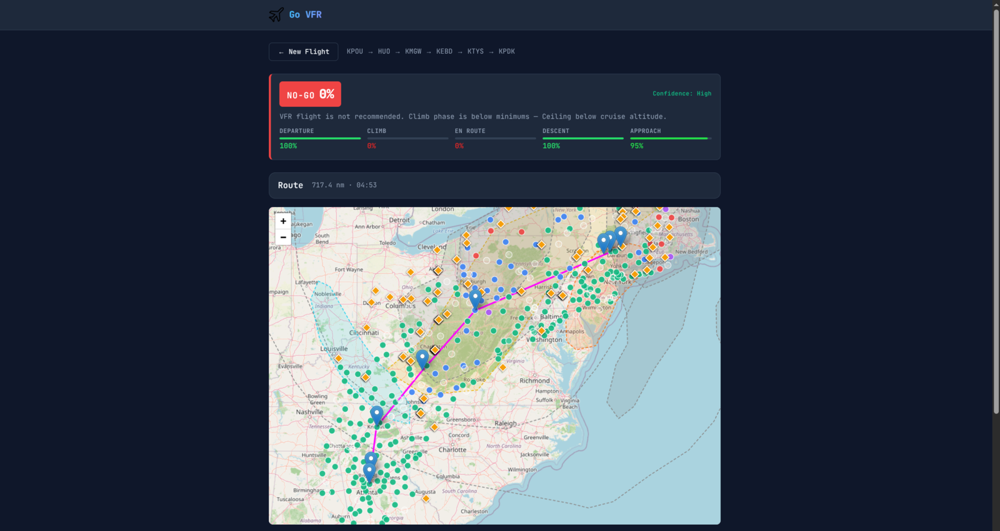

I'm a data/platform engineer who has spent a career building large-scale data and
quantitative research platforms at top-tier hedge funds and investment banks (Citadel,
Virtu, Morgan Stanley, Hutchin Hill Capital). I specialize in cross-language data systems
— Python, C++, Q/KDB+, Rust — and in partnering directly with researchers and stakeholders
to turn ideas and models into production systems.

**Stack:** Lots more, but lately Python · C++ · Rust · SQL · Apache Airflow · GCP · Docker · Parquet / Arrow

## Open source

### [Datui](https://github.com/derekwisong/datui) &nbsp;⭐ 120+

A terminal UI for exploring tabular data — handles massive partitioned datasets, local and
in the cloud (S3/GCS). Rust.

*[More demos →](https://derekwisong.github.io/datui/latest/demos.html)*

### [Pyagent](https://github.com/derekwisong/pyagent)

A multi-provider LLM agent framework with plugin, skill, and subagent systems. Python.

## Products

*Source currently private — the linked write-ups cover architecture and stack.*

### [Pitscope](https://beta.pitscope.com/)

Live Formula 1 race dashboard (beta). Real-time telemetry ingestion, Svelte front end,
Cloud Run. &nbsp;·&nbsp; [write-up →](https://derek.wisong.me/projects/f1-analytics-dashboard/)

### [Go VFR](https://gonogo-app-240046505853.us-central1.run.app/)

A decision-support tool for VFR pilots (prototype) — go/no-go assessment from weather,
route, and phase-by-phase risk. &nbsp;·&nbsp; [write-up →](https://derek.wisong.me/projects/go-vfr/)

## Connect

[Portfolio](https://derek.wisong.me) · [LinkedIn](https://www.linkedin.com/in/derek-wisong-84215632) · derekwisong@gmail.com
